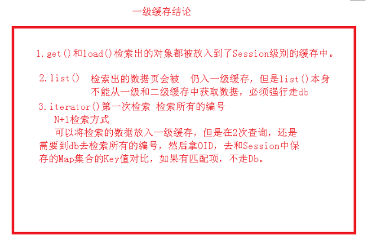
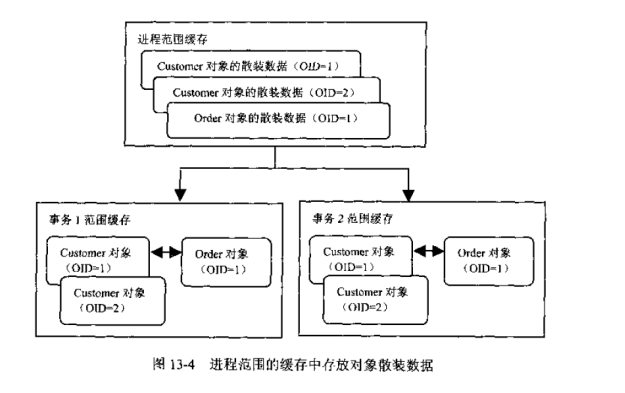
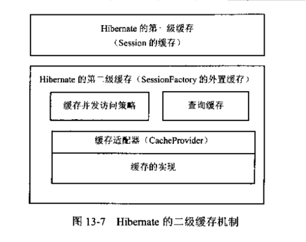
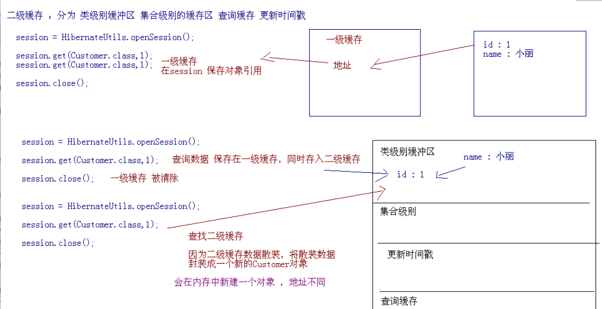
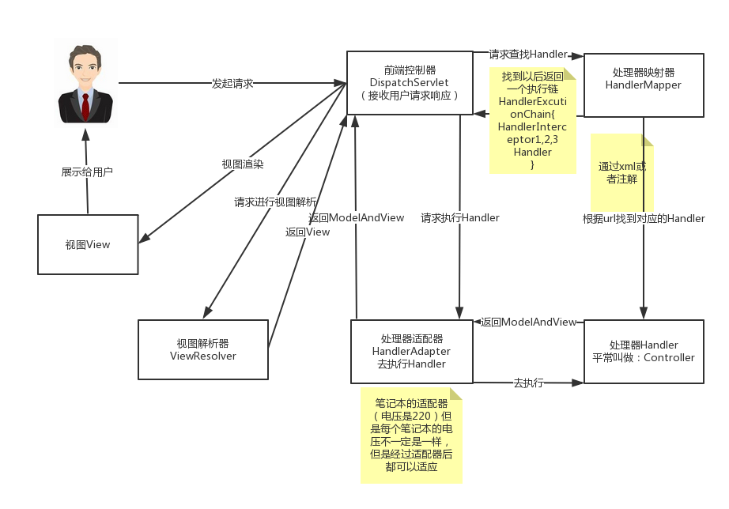

# 1. 谈一谈Hibernate的一级缓存、二级缓存和查询缓存
### 什么是缓存呢？
缓存：是计算机领域的概念，它介于应用程序和永久性数据存储源之间。

缓存：一般人的理解是在内存中的一块空间，可以将二级缓存配置到硬盘。用白话来说，就是一个存储数据的容器。我们关注的是，哪些数据需要被放入二级缓存。

作用：降低应用程序直接读写数据库的频率，从而提高程序的运行性能。缓存中的数据是数据存储源中数据的拷贝。缓存的物理介质通常是内存。

### 缓存在软件系统中的位置


### hibernate的缓存一般分为几种？
分为三种：一级缓存，二级缓存和查询缓存

### 一级缓存
session内的缓存即一级缓存，内置且不能被卸载，一个事务内有效。在这个空间存放了相互关联的Java对象，这种位于session缓存内的对象也别称为持久化对象，session负责根据持久化对象的状态变化来同步更新数据库。

session为应用程序提供了管理缓存的方法：evict(Object o)和clear()

一级缓存的生命周期和session的生命周期一致，当前session一旦关闭，一级缓存就消失了，因此一级缓存也叫session级的缓存或事务级缓存，一级缓存只存实体对象，它不会缓存一般的对象属性（查询缓存可以），即当获得对象后，就将该对象缓存起来，如果在同一session中再去获取这个对象时，它会先判断在缓存中有没有该对象的id，如果有则直接从缓存中获取此对象，反之才去数据库中取，取的同时再将此对象作为一级缓存处理。

以下方法支持一级缓存:

1. get()
2. load()
3. iterate（查询实体对象）

其中 Query 和Criteria的list() 只会缓存，但不会使用缓存（除非结合查询缓存）。



### 二级缓存
二级缓存是进程（N个事务）或集群范围内的缓存，可以被所有的Session共享，在多个事务之间共享

二级缓存是可配置的插件

二级缓存的散装数据


注意：如果缓存中的数据采用对象的散装数据形式，那么当不用的事务到缓存中查询OID为1的Customer对象时，获得的是Customer对象的散装数据，每个事务都必须分别根据散装数据重新构造出Customer实例，也就是说，每个事务都会获得不同的Customer对象。

二级缓存机制:


二级缓存分为：类级别缓存，集合级别缓存，更新时间戳和查询缓存。

二级缓存的散装原理图


类级别的二级缓存只适用于get和load获取数据，对query接口的list()可以将数据放置到类级别的缓存中，但不能使用query接口的list()从缓存中获取数据。

注意点：修改一级缓存的数据，会自动同步到二级缓存。

二级缓存也称进程级的缓存或SessionFactory级的缓存，二级缓存可以被所有session共享，二级缓存的生命周期和SessionFactory的生命周期一致。hibernate为实现二级缓存，只提供二级缓存的接口供第三方实现。二级缓存也是缓存实体对象，原理和方法都与一级缓存差不多，只是生命周期有所差异。

### 查询缓存
查询是数据库技术中最常用的操作，Hibernate为查询提供了缓存，用来提高查询速度，优化查询性能相同HQL语句检索结果的缓存

查询缓存依赖于二级缓存，查询缓存是针对普通属性结果集的缓存，对实体对象的结果集只缓存id（其id不是对象的真正id，可以看成是HQL或者SQL语句，它与查询的条件相关即where后的条件相关，不同的查询条件，其缓存的id也不一样）。查询缓存的生命周期，当前关联的表发生修改或是查询条件改变时，那么查询缓存生命周期结束，它不受一级缓存和二级缓存生命周期的影响，要想使用查询缓存需要手动配置。

### 结论
不要想当然的以为缓存可以提高性能，仅仅在你能够驾驭它并且条件合适的情况下才是这样的。hibernate的二级缓存限制还是比较多的。在不了解原理的情况下乱用，可能会有1+N的问题。不当的使用还可能导致读出脏数据。如果受不了hibernate的诸多限制，那么还是自己在应用程序的层面上做缓存吧。

在越高的层面上做缓存，效果就会越好。就好像尽管磁盘有缓存，数据库还是要实现自己的缓存，尽管数据库有缓存，咱们的应用程序还是要做缓存。因为底层的缓存它并不知道高层要用这些数据干什么，只能做的比较通用，而高层可以有针对性的实现缓存，所以在更高的级别上做缓存，效果也要好些吧。

缓存是位于应用程序与物理数据源之间，用于临时存放复制数据的内存区域，目的是为了减少应用程序对物理数据源访问的次数，从而提高应用程序的运行性能.      Hibernate在查询数据时，首先到缓存中去查找，如果找到就直接使用，找不到的时候就会从物理数据源中检索，所以，把频繁使用的数据加载到缓存区后，就可以大大减少应用程序对物理数据源的访问，使得程序的运行性能明显的提升。

>https://www.cnblogs.com/wl0000-03/p/6377990.html

其他补充：

1. Hibernate的Session提供了一级缓存的功能，默认总是有效的，当应用程序保存持久化实体、修改持久化实体时，Session并不会立即把这种改变提交到数据库，而是缓存在当前的Session中，除非显示调用了Session的flush()方法或通过close()方法关闭Session。通过一级缓存，可以减少程序与数据库的交互，从而提高数据库访问性能。
2. SessionFactory级别的二级缓存是全局性的，所有的Session可以共享这个二级缓存。不过二级缓存默认是关闭的，需要显示开启并指定需要使用哪种二级缓存实现类（可以使用第三方提供的实现）。一旦开启了二级缓存并设置了需要使用二级缓存的实体类，SessionFactory就会缓存访问过的该实体类的每个对象，除非缓存的数据超出了指定的缓存空间。
3. 一级缓存和二级缓存都是对整个实体进行缓存，不会缓存普通属性，如果希望对普通属性进行缓存，可以使用查询缓存。查询缓存是将HQL或SQL语句以及它们的查询结果作为键值对进行缓存，对于同样的查询可以直接从缓存中获取数据。查询缓存默认也是关闭的，需要显示开启。

# 2. 说说STRUTS的应用
### struts1与struts2都是mvc框架的经典实现模式。
Struts2不是从Struts1升级而来,而是有WebWork改名而来,而WebWork只是Xwork加了很多WEB拦截器而已?
区别：

1. 核心控制器改成了过滤器（过滤器比Servlet的级别要高，因为程序运行时是先进入过滤器再进入Servlet）
2. struts1要求业务类必须继承Action或dispatchAction，struts2不强制这么做，只需要提供一个pojo类。
3. 绑定值到业务类时struts1是通过ActionForm，struts2是通过模型或属性驱动直接绑定到Action属性。
4. struts1严重依赖于Servlet（因为太过于依赖于api的HttpServletRequest与HttpServletResponse的两个参数），
struts2就则脱离了Servlet的API。
5. 管理Action时struts1是单例模式，struts2是每个请求产生一个实例。
6. 在表达式的支持上struts2不仅有jstl，还有功能更加强大的ognl表达式。
7. struts1的类型转换是单向的（页面到ActionForm），struts2是双向的(页面到Action再到页面回显)
8. 校验，struts1没有针对具体方法的校验，struts2提供了指定某个方法进行效验，还有框架校验。
9. struts2提供了拦截器，利用拦截器可以在访问Action之前或之后增加如权限拦截等功能。
10. struts2提供了全局范围，包范围，Action范围的国际化资源文件管理实现。
11. struts2支持多种视图类型，如：jsp，freemaker，velocity，源代码等。

### Struts2的核心是什么,体现了什么思想
Struts2的核心是拦截器,基本上核心功能都是由拦截器完成,拦截器的实现体现了AOP(面向切面编程)思想?

### 为何继承ActionSupport
因为ActionSupport实现了Action接口，提供了国际化，校验功能。
ActionSupport实现了国际化功能：因为它提供了一个getText(String key)方法实现国际化,该方法从资源文件上获取国际化信息。
Action接口提供了五个常量(success,error,login,input,none)。

### Struts2 如何定位action中的方法
1. 感叹号定位方法（动态方法）。
2. 在xml配置文件中通过配置多个action，使用action的method指定方法。
3. 使用通配符(*)匹配方法。

### 模型驱动和属性驱动的区别是什么
模型驱动与属性驱动都是用来封装数据的。

1. 模型驱动：在实现类中实现ModelDriven<T>接口使用泛型把属性类封装起来，重写getModel()方法，然后在实现类里创建一个属性类的实例，
通过这个实例拿到封装进来的值，拿返回值的时候使用工具进行值拷贝。
2. 属性驱动：在实现类里定义属性，生成get与set方法，通过属性来拿值。

注意：模型驱动使用时注意的是在使用前先把属性类实例化，否则会出现空指针错误，拿返回对象的值需要用拷贝内存因为地址发生改变。
模型驱动不可以使用局部类型转换器。

### Struts2是怎样进行值封装的？
struts2的值封装实际上是采用了ognl表达式。struts2的拦截器经过模型驱动时会先判断action是否实现了ModelDriven，如果是则拿到模型的实例放在了栈的顶部，到属性驱动的时候会从栈里面把栈顶的实例给取出来，从页面传进来的值放在一个map集合当中，通过map集合进行迭代会通过ognl技术把值封装到实例中。

### Struts2如何进行校验
编程校验：

1. 继承ActionSupport，重写validate方法(针对所有方法)(服务器端编程,不推荐)。
2. validateXxx方法（Xxx代表的是方法名，针对某个方法进行效验）。
3. 如果有错误就把错误信息放在FieldError中，并且跳转到指定的错误业务类，没有就会进行action方法的调用。

校验框架:
每个Action类有一个校验文件，命名 Action类名-validation。xml，且与Action类同目录，这是对action里面所有的方法进行校验。对Action里面的指定方法做校验使用Action的类名-访问路径_方法名-validation.xml。

如:StudentAction-student_add-validation.xml    
在效验文件里又分为两种:   
字段校验：字段用什么校验器来校验。     
非字段校验：是用校验器校验什么字段。    
通俗点讲：字段校验：校验谁，用什么方法。      
非字段校验：用什么校验，校验谁 。

### 谈谈Struts2 的国际化
在struts2中是使用了拦截器来实现国际化。

struts2的国际化分为三部分：

1. Action范围，这种范围是用Action的实现类的类名来作为前缀__语言名称_国家地区名（大写）.properties.
2. 包范围，包范围是用package作为前缀__语言名称_国家地区名（大写）.properties。
3. 全局范围，全局范围的前缀默认的是application，可以通过xml配置文件配置常量(使用constant标签注册i18l拦截器)来指定前缀,前缀__语言名称_国家地区名（大写）.properties。

国际化实现的原理:通过i18n拦截器获得请求参数request——locale的值(zh或者是en)并把当前的值转化为locale对象，把locale对象存在ww_trans_i18n_locale的session作用域中，根据struts2的请求处理流程，拦截器只会在进入action的时候才会调用，所有我们一般把对jsp的访问转化为对action的访问。

### OGNL是什么你在项目中如何使用它
OGNL是：对象图形导航语言。

原ognl是单个对象的，在struts2的应用是多个对象的，struts2的类型转换也是通过ognl来实现的。

Struts2中默认的表达式语言就是ognl，struts2的取值设值都是通过ognl来实现的,struts2要依靠它的标签才可以使用ognl。
相对于jstl或者其他表达式语言，它有如下优势：

1. 能够调用对象实例的方法
2. 能够调用类的静态方法
3. 操作集合对象
4. 访问Ognl上下文

取值时ognl有三个参数：

1. 表达式，
2. ognl的上下文(map)，
3. 对象实例(值栈)。

如果表达式带#号是从上下文中(map)拿值，否则是从值栈中拿值。
设值时有四个参数：

1. 表达式，
2. ognl的上下文(map)，
3. 对象实例，
4. 设入的值

如果表达式带#号是把值设入上下文中(map)，否则是把值设入值栈中。
在struts2中 ognl的实现关系:ActionConetxt。
ognl 3个常用的符号 # $ %

'#'

1. 构造map，list集合。
2. 取ognl上下文的值。
3. 用来过滤集合。

'$' 

1. 在校验框架中取资源文件中的值。
2. 可以在配置文件中传递参数。

'%' 

使用百分号可以进行转义。

### Strust2如何访问Servlet API
1. 通过ActionContext可以获得request，application，session三个作用域(struts2实际上是通过适配器来把servlet的api转换为一个map，
    并把这些map放在ActionContext里面)。
2. 通过ActionContext的子类ServletActionContext去获取原滋原味的API。
3. 可以通过实现ServletRequestAware接口，重写里面的setServletRequest方法可以获得request，实际上是通过set的依赖注入。

### 什么是拦截器 说说Struts2用拦截器来干什么 说出6个拦截器来
在访问类的某个方法或者属性之前执行，拦截的是Action的请求，进行拦截然后在方法的执行前或者之后加入某些操作，    
如：国际化，权限，效验等与源代码无关的操作。     
国际化，表单重复提交，类型转换，自动装配，数据封装,异常处理，模型驱动，请求参数，处理类型转换错误，日志拦截器。

### 如何实现自定义拦截器？
可以继承MethodFilterInterceptor重写doIntercept方法指定某个方法进行拦截，或者继承AbstractInterceptor，重写intercept方法

在xml配置文件中定义自定义拦截器，然后注入到拦截器栈中，再把拦截器引用到action中。
    在把拦截器注入拦截器栈时配置<param\>标签，使用name属性配置excludeMethods表示不拦截指定方法。
    在配置文件中配置includeMethods指定拦截某个方法。
    可以配置到某个action单独使用，也可以配置到包下面的所有action使用。

### ActionContext是用来干什么的
ActionContext是Action的上下文。

通过ActionContext这个类来可以获得:request，application，session，Locale、ValueStack,ConversionErrors

1. 可以获得servlet的api：request，application，session。
2. 进行国际化：获得语言环境 Locale。
3. 收集错误信息：ConversionErrors。
4. 有个值栈来装action实例与创建的模型驱动的实例:ValueStack。
5. ActionContext是线程安全的-用本地线程实现的。

### Struts2是如何实现mvc的：struts2的底层视图默认是freemaker。
什么是mvc？

    M：模型，V：视图，C：控制器

    在struts2中分别对应什么？

    M(模型)：除核心控制器外都属于模型，实现业务的类(service层与dao层)。    
    V(视图)：result,type,dispatcher默认的(jsp，freemaker，velocity，源代码等)。    
    C(控制器)：核心控制器与业务控制器。     

    mvc解决什么问题？

    解决了数据封装，类型转换，数据效验，国际化，异常处理等问题。

### 为什么要继承默认的包？
因为在Strtus2里面默认有很多的常量,拦截器,还有一些bean,如果继承默认的包,这些默认值和常量就会继承过来

### 常见的有那些有十几种结果集类型
常见的结果集类型有dispatcher,redirect,redirectAction,stream等。

默认的是dispatcher,值得是转发    
redirect指重定向,    
redirectAction是重定向到一个Action     
stream是返回一个流,一般用在文件下载上面    

### 开发项目时struts2在页面怎样拿值
从值栈中或者是ognl的上下文

### 怎么样用Struts2进行文件的上传或者下载
Struts2里面已经提供了默认的拦截器来处理上传,只要在jsp用了s:file标签,把s:from的enctype 属性设置为 multipart/form-data,然后在action里面定义三个字段 File file ,String [file]ContentType,String [file]?FileName即可,如果有多个文件上传,那么就用    List<File>来接受,然后把接受到的File构建成FileInputStream,转化成硬盘上面的文件即可(用输出流)
    下载用了resust为stream的类型,然后在action定义四个属性,默认的有个是InputStream 的类型叫inputStream的,从硬盘上面读取文件到这个流    赋值即可.

### 简单讲下struts里面的标签,说不少于5个
s:iterater ?s:property s:form s:url s:if 等等

### 默认struts2里面的标签取值都是从那里取值的
默认都是从OGNL值栈里面取值的?

### ValueStack分为那两部分,组成部分是什么,分别怎么访问
分为对象栈和ContextMap ,对象栈里面放入的是Action及其用户定义的对象,在前台可以直接访问,在contextMap里面放入的是Servlet对象转    化后map,譬如requestMap,sessionMap,访问的时候前面加#即可.

### 标签<s:property\>和el表达式有什么区别
它们都可以从值栈里面取值,但是el表达式只能取属性有get set方法的简单数据类型,如果要取得数组的一些方法等复杂数据对象类型,那么就要用s:property标签

### struts2的请求处理流程
1. 客户端发送请求。
2. 经过一系列的过滤器(如:ActionContextCleanUp、SiteMesh等)到达核心控制器(FilterDispatcher)。
3. 核心控制器通过ActionMapper决定调用哪个Action，如果不是调用Action就直接跳转到jsp页面。
4. 如果ActionMapper决定调用了某个Action，核心控制器就把请求的处理交给一个代理类(ActionProxy)。
5. 代理类通过配置管理器(Configuration Manager)找到配置文件（struts.xml）找到需要调用的Action类。
6. 代理类还要创建一个Action的调度器(ActionInvocation)。
7. 由调度器去调用Action，当然这里还涉及到一些相关的拦截器的调用。
8. Action执行完后，这个调度器还会创建一个Result返回结果集，返回结果前还可以做一些操作(结果集前的监听器)。

# 3. 解释一下MyBatis中命名空间（namespace）的作用
在大型项目中，可能存在大量的SQL语句，这时候为每个SQL语句起一个唯一的标识（ID）就变得并不容易了。为了解决这个问题，在MyBatis中，可以为每个映射文件起一个唯一的命名空间，这样定义在这个映射文件中的每个SQL语句就成了定义在这个命名空间中的一个ID。只要我们能够保证每个命名空间中这个ID是唯一的，即使在不同映射文件中的语句ID相同，也不会再产生冲突了。

# 4. MyBatis中的动态SQL是什么意思？
对于一些复杂的查询，我们可能会指定多个查询条件，但是这些条件可能存在也可能不存在，需要根据用户指定的条件动态生成SQL语句。如果不使用持久层框架我们可能需要自己拼装SQL语句，还好MyBatis提供了动态SQL的功能来解决这个问题。MyBatis中用于实现动态SQL的元素主要有：

- if
- choose / when / otherwise
- trim
- where
- set
- foreach

#### if
if就是简单的条件判断，利用if语句我们可以实现某些简单的条件选择。
```XML
    <select id="dynamicIfTest" parameterType="Blog" resultType="Blog">
        select * from t_blog where 1 = 1
        <if test="title != null">
            and title = #{title}
        </if>
        <if test="content != null">
            and content = #{content}
        </if>
        <if test="owner != null">
            and owner = #{owner}
        </if>
    </select>
```

这条语句的意思非常简单，如果你提供了title参数，那么就要满足title=#{title}，同样如果你提供了Content和Owner的时候，它们也需要满足相应的条件，之后就是返回满足这些条件的所有Blog，这是非常有用的一个功能，以往我们使用其他类型框架或者直接使用JDBC的时候， 如果我们要达到同样的选择效果的时候，我们就需要拼SQL语句，这是极其麻烦的，比起来，上述的动态SQL就要简单多了

#### choose,when和otherwise
choose元素的作用就相当于JAVA中的switch语句，基本上跟JSTL中的choose的作用和用法是一样的，通常都是与when和otherwise搭配的。看如下一个例子：
```XML
    <select id="dynamicChooseTest" parameterType="Blog" resultType="Blog">
        select * from t_blog where 1 = 1 
        <choose>
            <when test="title != null">
                and title = #{title}
            </when>
            <when test="content != null">
                and content = #{content}
            </when>
            <otherwise>
                and owner = "owner1"
            </otherwise>
        </choose>
    </select>
```

when元素表示当when中的条件满足的时候就输出其中的内容，跟JAVA中的switch效果差不多的是按照条件的顺序，当when中有条件满足的时候，就会跳出choose，即所有的when和otherwise条件中，只有一个会输出，当所有的我很条件都不满足的时候就输出otherwise中的内容。所以上述语句的意思非常简单， 当title!=null的时候就输出and titlte = #{title}，不再往下判断条件，当title为空且content!=null的时候就输出and content = #{content}，当所有条件都不满足的时候就输出otherwise中的内容。

#### where
where语句的作用主要是简化SQL语句中where中的条件判断的，先看一个例子，再解释一下where的好处。
```XML
    <select id="dynamicWhereTest" parameterType="Blog" resultType="Blog">
        select * from t_blog 
        <where>
            <if test="title != null">
                title = #{title}
            </if>
            <if test="content != null">
                and content = #{content}
            </if>
            <if test="owner != null">
                and owner = #{owner}
            </if>
        </where>
    </select>
```

where元素的作用是会在写入where元素的地方输出一个where，另外一个好处是你不需要考虑where元素里面的条件输出是什么样子的，MyBatis会智能的帮你处理，如果所有的条件都不满足那么MyBatis就会查出所有的记录，如果输出后是and 开头的，MyBatis会把第一个and忽略，当然如果是or开头的，MyBatis也会把它忽略；此外，在where元素中你不需要考虑空格的问题，MyBatis会智能的帮你加上。像上述例子中，如果title=null， 而content != null，那么输出的整个语句会是select * from t_blog where content = #{content}，而不是select * from t_blog where and content = #{content}，因为MyBatis会智能的把首个and 或 or 给忽略。

#### trim
trim元素的主要功能是可以在自己包含的内容前加上某些前缀，也可以在其后加上某些后缀，与之对应的属性是prefix和suffix；可以把包含内容的首部某些内容覆盖，即忽略，也可以把尾部的某些内容覆盖，对应的属性是prefixOverrides和suffixOverrides；正因为trim有这样的功能，所以我们也可以非常简单的利用trim来代替where元素的功能，示例代码如下：
```XML
    <select id="dynamicTrimTest" parameterType="Blog" resultType="Blog">
        select * from t_blog 
        <trim prefix="where" prefixOverrides="and |or">
            <if test="title != null">
                title = #{title}
            </if>
            <if test="content != null">
                and content = #{content}
            </if>
            <if test="owner != null">
                or owner = #{owner}
            </if>
        </trim>
    </select>
```

#### set
set元素主要是用在更新操作的时候，它的主要功能和where元素其实是差不多的，主要是在包含的语句前输出一个set，然后如果包含的语句是以逗号结束的话将会把该逗号忽略，如果set包含的内容为空的话则会出错。有了set元素我们就可以动态的更新那些修改了的字段。下面是一段示例代码：
```XML
    <update id="dynamicSetTest" parameterType="Blog">
        update t_blog
        <set>
            <if test="title != null">
                title = #{title},
            </if>
            <if test="content != null">
                content = #{content},
            </if>
            <if test="owner != null">
                owner = #{owner}
            </if>
        </set>
        where id = #{id}
    </update>
```

上述示例代码中，如果set中一个条件都不满足，即set中包含的内容为空的时候就会报错。

#### foreach
foreach的主要用在构建in条件中，它可以在SQL语句中进行迭代一个集合。foreach元素的属性主要有item，index，collection，open，separator，close。item表示集合中每一个元素进行迭代时的别名，index指定一个名字，用于表示在迭代过程中，每次迭代到的位置，open表示该语句以什么开始，separator表示在每次进行迭代之间以什么符号作为分隔符，close表示以什么结束，在使用foreach的时候最关键的也是最容易出错的就是collection属性，该属性是必须指定的，但是在不同情况下，该属性的值是不一样的，主要有一下3种情况：

1. 如果传入的是单参数且参数类型是一个List的时候，collection属性值为list
2. 如果传入的是单参数且参数类型是一个array数组的时候，collection的属性值为array
3. 如果传入的参数是多个的时候，我们就需要把它们封装成一个Map了，当然单参数也可以封装成map，实际上如果你在传入参数的时候，在MyBatis里面也是会把它封装成一个Map的，map的key就是参数名，所以这个时候collection属性值就是传入的List或array对象在自己封装的map里面的key

- 单参数List的类型:
```XML
    <select id="dynamicForeachTest" resultType="Blog">
        select * from t_blog where id in
        <foreach collection="list" index="index" item="item" open="(" separator="," close=")">
            #{item}
        </foreach>
    </select>
```

上述collection的值为list，对应的Mapper是这样的
```JAVA
public List<Blog> dynamicForeachTest(List<Integer> ids);
```

 测试代码
```JAVA
    @Test
    public void dynamicForeachTest() {
        SqlSession session = Util.getSqlSessionFactory().openSession();
        BlogMapper blogMapper = session.getMapper(BlogMapper.class);
        List<Integer> ids = new ArrayList<Integer>();
        ids.add(1);
        ids.add(3);
        ids.add(6);
        List<Blog> blogs = blogMapper.dynamicForeachTest(ids);
        for (Blog blog : blogs)
            System.out.println(blog);
        session.close();
    }
```

- 单参数array数组的类型
```XML
    <select id="dynamicForeach2Test" resultType="Blog">
        select * from t_blog where id in
        <foreach collection="array" index="index" item="item" open="(" separator="," close=")">
            #{item}
        </foreach>
    </select>
```

上述collection为array，对应的Mapper代码:
```JAVA
public List<Blog> dynamicForeach2Test(int[] ids);
```

对应的测试代码：
```JAVA
    @Test
    public void dynamicForeach2Test() {
        SqlSession session = Util.getSqlSessionFactory().openSession();
        BlogMapper blogMapper = session.getMapper(BlogMapper.class);
        int[] ids = new int[] {1,3,6,9};
        List<Blog> blogs = blogMapper.dynamicForeach2Test(ids);
        for (Blog blog : blogs)
            System.out.println(blog);
        session.close();
    }
```

- 自己把参数封装成Map的类型
```XML
    <select id="dynamicForeach3Test" resultType="Blog">
        select * from t_blog where title like "%"#{title}"%" and id in
        <foreach collection="ids" index="index" item="item" open="(" separator="," close=")">
            #{item}
        </foreach>
    </select>
```

上述collection的值为ids，是传入的参数Map的key，对应的Mapper代码：
```JAVA
public List<Blog> dynamicForeach3Test(Map<String, Object> params);
```

对应测试代码：
```JAVA
    @Test
    public void dynamicForeach3Test() {
        SqlSession session = Util.getSqlSessionFactory().openSession();
        BlogMapper blogMapper = session.getMapper(BlogMapper.class);
        final List<Integer> ids = new ArrayList<Integer>();
        ids.add(1);
        ids.add(2);
        ids.add(3);
        ids.add(6);
        ids.add(7);
        ids.add(9);
        Map<String, Object> params = new HashMap<String, Object>();
        params.put("ids", ids);
        params.put("title", "中国");
        List<Blog> blogs = blogMapper.dynamicForeach3Test(params);
        for (Blog blog : blogs)
            System.out.println(blog);
        session.close();
    }
```

- foreach标签遍历的集合元素类型是Map.Entry类型时，index属性指定的变量代表对应的Map.Entry的key，item属性指定的变量代表对应的Map.Entry的value。此时如果对应的集合是Map.entrySet，则对应的collection属性用collection。foreach在进行遍历的时候如果传入的参数是List类型，则其collection属性的值可以是list或collection，但如果传入的参数是Set类型，则collection属性的值只能用collection。
```XML
    <select id="dynamicForeachTest" resultType="Blog">
        select * from t_blog where id in
        <!-- 遍历的对象是Map.Entry时，index代表对应的key，item代表对应的value -->
        <foreach collection="collection" index="key" item="value" open="(" separator="," close=")">
            #{key}, #{value}
        </foreach>
    </select>
```

其对应的接口方法大概是如下这样：
```JAVA
    public List<Blog> dynamicForeachTest(Set<Map.Entry<Integer, Integer>> ids);
```

- bind标签，动态SQL中已经包含了这样一个新的标签，它的功能是在当前OGNL上下文中创建一个变量并绑定一个值。有了它以后我们以前的模糊查询就可以改成这个样子：
```XML
    <select id="fuzzyQuery" resultType="Blog" parameterType="java.lang.String">  
        <!-- bind标签用于创建新的变量 -->
        <bind name="titleLike" value="'%'+_parameter+'%'"/>
        select * from t_blog where title like #{titleLike}  
    </select>
```

# 5. Spring MVC注解的优点
1. XML配置起来有时候冗长，此时注解可能是更好的选择，如jpa的实体映射；注解在处理一些不变的元数据时有时候比XML方便的多，比如springmvc的数据绑定，如果用xml写的代码会多的多；
2. 注解最大的好处就是简化了XML配置；其实大部分注解一定确定后很少会改变，所以在一些中小项目中使用注解反而提供了开发效率，所以没必要一头走到黑；
3. 注解相对于XML的另一个好处是类型安全的，XML只能在运行期才能发现问题。

注解的缺点：

1. 在使用spring注解时，会发现注解分散到很多类中，不好管理和维护；
2. 注解的开启/关闭必须修改源代码，因为注解是源代码绑定的，如果要修改，需要改源码，有这个问题，所以如果是这种情况，还是使用XML配置方式；比如数据源；
3. 注解还一个缺点就是灵活性，比如在之前翻译的Spring Framework 4.0 M1: WebSocket 支持；在实现复杂的逻辑上，没有XML来的更加强大；注解就是要么用，要么不用；
4. 通用配置还是走XML吧，比如事务配置，比如数据库连接池等等，即通用的配置集中化，而不是分散化，如很多人使用@Transactional来配置事务，在很多情况下这是一种太分散化的配置；
5. XML方式比注解的可扩展性和复杂性维护上好的多，比如需要哪些组件，不需要哪些；在面对这种情况，注解扫描机制比较逊色，因为规则很难去写或根本不可能写出来；

# 6. springmvc和spring-boot区别？
### spring和springMvc：
1. spring是一个一站式的轻量级的java开发框架，核心是控制反转（IOC）和面向切面（AOP），针对于开发的WEB层(springMvc)、业务层(Ioc)、持久层(jdbcTemplate)等都提供了多种配置解决方案；
2. springMvc是spring基础之上的一个MVC框架，主要处理web开发的路径映射和视图渲染，属于spring框架中WEB层开发的一部分；

### springMvc和springBoot：
1. springMvc属于一个企业WEB开发的MVC框架，涵盖面包括前端视图开发、文件配置、后台接口逻辑开发等，XML、config等配置相对比较繁琐复杂；

2. springBoot框架相对于springMvc框架来说，更专注于开发微服务后台接口，不开发前端视图；

### springBoot和springCloud：
1. spring boot使用了默认大于配置的理念，集成了快速开发的spring多个插件，同时自动过滤不需要配置的多余的插件，简化了项目的开发配置流程，一定程度上取消xml配置，是一套快速配置开发的脚手架，能快速开发单个微服务；

2. spring cloud大部分的功能插件都是基于springBoot去实现的，springCloud关注于全局的微服务整合和管理，将多个springBoot单体微服务进行整合以及管理；  springCloud依赖于springBoot开发，而springBoot可以独立开发；

### 总结：
1. Spring 框架就像一个家族，有众多衍生产品例如 boot、security、jpa等等。但他们的基础都是Spring的ioc、aop等. ioc 提供了依赖注入的容器， aop解决了面向横切面编程，然后在此两者的基础上实现了其他延伸产品的高级功能；
2. springMvc是基于Servlet 的一个MVC框架主要解决WEB开发的问题，因为Spring的配置非常复杂，各种XML、JavaConfig、servlet处理起来比较繁琐；
3. 为了简化开发者的使用，从而创造性地推出了springBoot框架，默认优于配置，简化了springMvc的配置流程；
但区别于springMvc的是，springBoot专注于微服务方面的接口开发，和前端解耦，虽然springBoot也可以做成springMvc前后台一起开发，但是这就有点不符合springBoot框架的初衷了；
4. 对于springCloud框架来说，它和springBoot一样，注重的是微服务的开发，但是springCloud更关注的是全局微服务的整合和管理，相当于管理多个springBoot框架的单体微服务；
>https://blog.csdn.net/alan_liuyue/article/details/80656687

# 7. SpringMVC的运行机制，运行机制的每一部分的相关知识？

#### SpringMVC流程
1. 用户发送请求至前端控制器DispatcherServlet。
2. DispatcherServlet收到请求调用HandlerMapping处理器映射器。
3. 处理器映射器找到具体的处理器(可以根据xml配置、注解进行查找)，生成处理器对象及处理器拦截器(如果有则生成)一并返回给DispatcherServlet。
4. DispatcherServlet调用HandlerAdapter处理器适配器。
5. HandlerAdapter经过适配调用具体的处理器(Controller，也叫后端控制器)。
6. Controller执行完成返回ModelAndView。
7. HandlerAdapter将controller执行结果ModelAndView返回给DispatcherServlet。
8. DispatcherServlet将ModelAndView传给ViewReslover视图解析器。
9. ViewReslover解析后返回具体View。
10. DispatcherServlet根据View进行渲染视图（即将模型数据填充至视图中）。
11. DispatcherServlet响应用户。

#### 组件说明
DispatcherServlet：作为前端控制器，整个流程控制的中心，控制其它组件执行，统一调度，降低组件之间的耦合性，提高每个组件的扩展性。

HandlerMapping：通过扩展处理器映射器实现不同的映射方式，例如：配置文件方式，实现接口方式，注解方式等。 

HandlAdapter：通过扩展处理器适配器，支持更多类型的处理器。

ViewResolver：通过扩展视图解析器，支持更多类型的视图解析，例如：jsp、freemarker、pdf、excel等。

1. 前端控制器DispatcherServlet（不需要工程师开发）,由框架提供
作用：接收请求，响应结果，相当于转发器，中央处理器。有了dispatcherServlet减少了其它组件之间的耦合度。
用户请求到达前端控制器，它就相当于mvc模式中的c，dispatcherServlet是整个流程控制的中心，由它调用其它组件处理用户的请求，dispatcherServlet的存在降低了组件之间的耦合性。
2. 处理器映射器HandlerMapping(不需要工程师开发),由框架提供
作用：根据请求的url查找Handler
HandlerMapping负责根据用户请求找到Handler即处理器，springmvc提供了不同的映射器实现不同的映射方式，例如：配置文件方式，实现接口方式，注解方式等。
3. 处理器适配器HandlerAdapter
作用：按照特定规则（HandlerAdapter要求的规则）去执行Handler
通过HandlerAdapter对处理器进行执行，这是适配器模式的应用，通过扩展适配器可以对更多类型的处理器进行执行。
4. 处理器Handler(需要工程师开发)
注意：编写Handler时按照HandlerAdapter的要求去做，这样适配器才可以去正确执行Handler
Handler 是继DispatcherServlet前端控制器的后端控制器，在DispatcherServlet的控制下Handler对具体的用户请求进行处理。
由于Handler涉及到具体的用户业务请求，所以一般情况需要工程师根据业务需求开发Handler。
5. 视图解析器View resolver(不需要工程师开发),由框架提供
作用：进行视图解析，根据逻辑视图名解析成真正的视图（view）
View Resolver负责将处理结果生成View视图，View Resolver首先根据逻辑视图名解析成物理视图名即具体的页面地址，再生成View视图对象，最后对View进行渲染将处理结果通过页面展示给用户。 springmvc框架提供了很多的View视图类型，包括：jstlView、freemarkerView、pdfView等。
一般情况下需要通过页面标签或页面模版技术将模型数据通过页面展示给用户，需要由工程师根据业务需求开发具体的页面。
6. 视图View(需要工程师开发jsp...)
View是一个接口，实现类支持不同的View类型（jsp、freemarker、pdf...）

#### 核心架构的具体流程步骤如下：

1. 首先用户发送请求——>DispatcherServlet，前端控制器收到请求后自己不进行处理，而是委托给其他的解析器进行处理，作为统一访问点，进行全局的流程控制；
2. DispatcherServlet——>HandlerMapping， HandlerMapping 将会把请求映射为HandlerExecutionChain 对象（包含一个Handler 处理器（页面控制器）对象、多个HandlerInterceptor 拦截器）对象，通过这种策略模式，很容易添加新的映射策略；
3. DispatcherServlet——>HandlerAdapter，HandlerAdapter 将会把处理器包装为适配器，从而支持多种类型的处理器，即适配器设计模式的应用，从而很容易支持很多类型的处理器；
4. HandlerAdapter——>处理器功能处理方法的调用，HandlerAdapter 将会根据适配的结果调用真正的处理器的功能处理方法，完成功能处理；并返回一个ModelAndView 对象（包含模型数据、逻辑视图名）；
5. ModelAndView的逻辑视图名——> ViewResolver， ViewResolver 将把逻辑视图名解析为具体的View，通过这种策略模式，很容易更换其他视图技术；
6. View——>渲染，View会根据传进来的Model模型数据进行渲染，此处的Model实际是一个Map数据结构，因此很容易支持其他视图技术；
7. 返回控制权给DispatcherServlet，由DispatcherServlet返回响应给用户，到此一个流程结束。

####  springmvc原理


第一步:用户发起请求到前端控制器（DispatcherServlet）

第二步：前端控制器请求处理器映射器（HandlerMappering）去查找处理器（Handle）：通过xml配置或者注解进行查找

第三步：找到以后处理器映射器（HandlerMappering）像前端控制器返回执行链（HandlerExecutionChain）

第四步：前端控制器（DispatcherServlet）调用处理器适配器（HandlerAdapter）去执行处理器（Handler）

第五步：处理器适配器去执行Handler

第六步：Handler执行完给处理器适配器返回ModelAndView

第七步：处理器适配器向前端控制器返回ModelAndView

第八步：前端控制器请求视图解析器（ViewResolver）去进行视图解析

第九步：视图解析器像前端控制器返回View

第十步：前端控制器对视图进行渲染

第十一步：前端控制器向用户响应结果

# 8. Mybatis和Hibernate区别？
- 简介

Hibernate：Hibernate是当前最流行的ORM框架之一，对JDBC提供了较为完整的封装。Hibernate的O/R Mapping实现了POJO 和数据库表之间的映射，以及SQL的自动生成和执行。

Mybatis：Mybatis同样也是非常流行的ORM框架，主要着力点在于 POJO 与 SQL 之间的映射关系。然后通过映射配置文件，将SQL所需的参数，以及返回的结果字段映射到指定 POJO 。相对Hibernate“O/R”而言，Mybatis 是一种“Sql Mapping”的ORM实现。

- 缓存机制对比

相同点

Hibernate和Mybatis的二级缓存除了采用系统默认的缓存机制外，都可以通过实现你自己的缓存或为其他第三方缓存方案，创建适配器来完全覆盖缓存行为。

不同点

Hibernate的二级缓存配置在SessionFactory生成的配置文件中进行详细配置，然后再在具体的表-对象映射中配置是那种缓存。

MyBatis的二级缓存配置都是在每个具体的表-对象映射中进行详细配置，这样针对不同的表可以自定义不同的缓存机制。并且Mybatis可以在命名空间中共享相同的缓存配置和实例，通过Cache-ref来实现。

两者比较

因为Hibernate对查询对象有着良好的管理机制，用户无需关心SQL。所以在使用二级缓存时如果出现脏数据，系统会报出错误并提示。而MyBatis在这一方面，使用二级缓存时需要特别小心。如果不能完全确定数据更新操作的波及范围，避免Cache的盲目使用。否则，脏数据的出现会给系统的正常运行带来很大的隐患。

Mybatis：小巧、方便、高效、简单、直接、半自动化

Hibernate：强大、方便、高效、复杂、间接、全自动化

